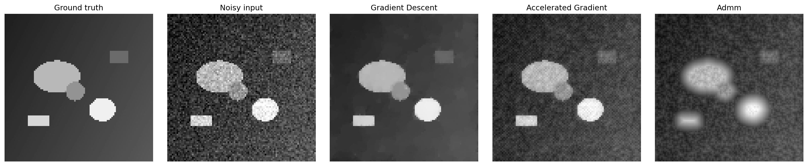

# Optimization Lab: TV Denoising

This repository focuses on the Rudin-Osher-Fatemi total-variation denoising problem and compares three solvers:

- gradient descent with backtracking
- accelerated gradient descent
- ADMM with an FFT-based linear solve

The project is intentionally self-contained. It generates a synthetic phantom image, adds Gaussian noise, denoises it, and writes a comparison figure plus a convergence report.



## Why this project is useful

- It ties together finite differences, adjoints, convex regularization, gradient methods, and splitting methods.
- It is easy to demo in a GitHub README because the outputs are visual.
- It is small enough to understand, but still shows real optimization engineering.

## Problem

We solve

$$
\min_x \; \frac{1}{2}\|x-y\|_2^2 + \lambda \operatorname{TV}(x),
$$

where $y$ is a noisy image and $\operatorname{TV}$ is the isotropic total variation semi-norm.

## Quick start

```bash
python -m venv .venv
source .venv/bin/activate
pip install -r requirements.txt
python -m optlab --output-dir artifacts
```

The command creates:

- `artifacts/benchmark.png`
- `artifacts/noisy_input.png`
- `artifacts/phantom.png`
- `artifacts/results.csv`

## Project structure

```text
optimization-lab/
├── pyproject.toml
├── README.md
├── requirements.txt
├── figures/
│   ├── benchmark.png
│   └── phantom.png
├── src/optlab/
│   ├── __init__.py
│   ├── __main__.py
│   ├── cli.py
│   ├── metrics.py
│   ├── operators.py
│   ├── problems.py
│   └── solvers.py
└── tests/
    ├── test_operators.py
    └── test_solvers.py
```

## What to mention on GitHub

This project demonstrates:

- numerical optimization
- convex modeling
- operator adjoints and finite differences
- backtracking and acceleration
- splitting methods and FFT-based linear algebra
- reproducible benchmarking


